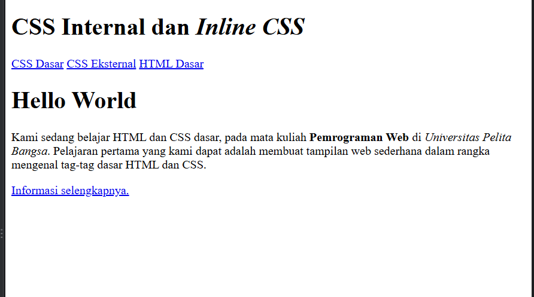
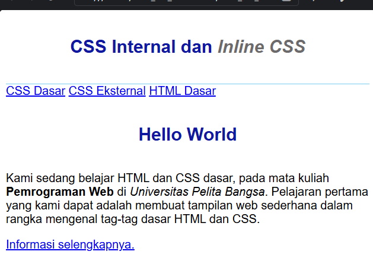
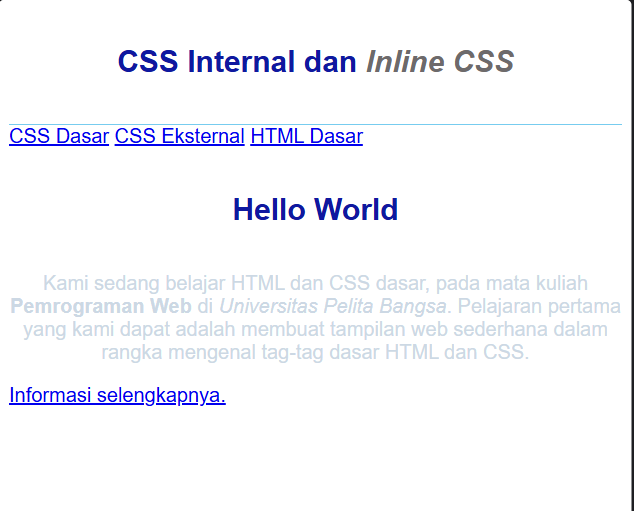
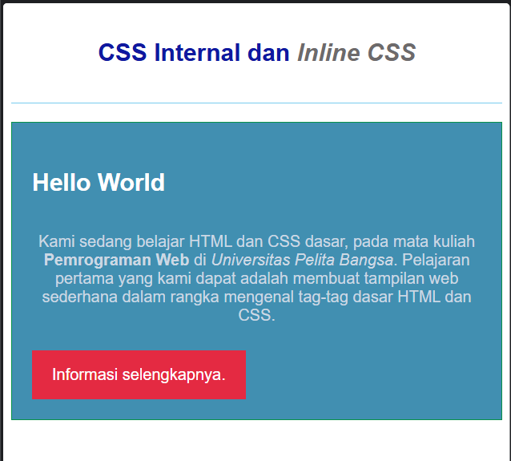
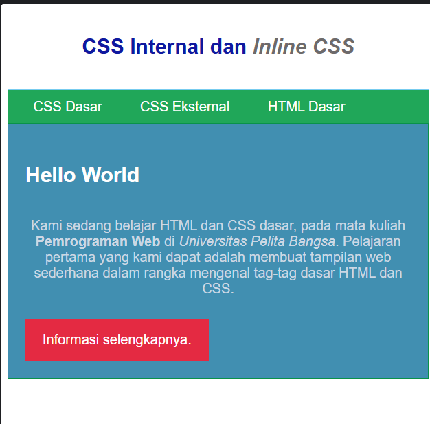
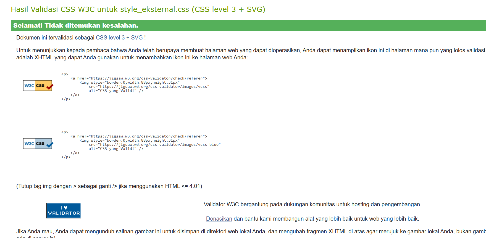
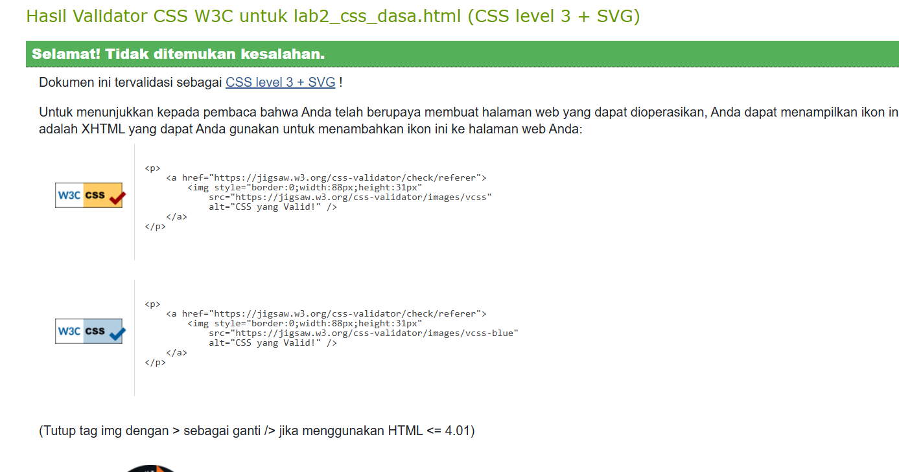

# Laporan Praktikum 3: CSS Dasar

**Mata Kuliah:** Pemrograman Web
**Nama:** [isi nama]
**NIM:** [isi NIM]
**Kelas:** [isi kelas]

## Tujuan Praktikum

1. Memahami konsep dasar CSS.
2. Memahami aturan penulisan pada CSS.
3. Memahami selector sebagai pengontrol CSS.
4. Membuat pengaturan CSS pada HTML.

## Struktur File

```
Lab3Web/
├── lab2_css_dasar.html
├── style_eksternal.css
├── README.md
└── screnshot/
    ├── 01_html_polos.png
    ├── 02_css_internal.png
    ├── 03_inline_css.png
    ├── 04_css_eksternal.png
    ├── 05_selector.png
    ├── validasi_eksternal.png
    └── validasi_internal.png
```

---

## Langkah-langkah Praktikum

### 1. Membuat Dokumen HTML

Dibuat file `lab2_css_dasar.html` berisi struktur dasar HTML: `<header>` dengan judul `<h1>`, `<nav>` berisi tiga link, dan `<div id="intro">` berisi judul, paragraf, serta link bertombol dengan class `button btn-primary`. Pada tahap ini belum ada CSS sama sekali, sehingga tampilan masih memakai gaya bawaan browser.



### 2. Mendeklarasikan CSS Internal

CSS internal ditulis di dalam tag `<style>` pada bagian `<head>`. Pada tahap ini diatur font pada `body`, tinggi minimum dan garis bawah pada `header`, serta ukuran, warna, perataan, dan padding pada `h1`. Selector `h1 i` dipakai agar teks miring pada judul berwarna abu-abu.

```html
<style>
    body {
        font-family: 'Open Sans', sans-serif;
    }
    header {
        min-height: 80px;
        border-bottom: 1px solid #77CCEF;
    }
    h1 {
        font-size: 24px;
        color: #0F189F;
        text-align: center;
        padding: 20px 10px;
    }
    h1 i {
        color: #6d6a6b;
    }
</style>
```

Hasil: judul menjadi biru, rata tengah, dan header memiliki garis biru muda di bagian bawahnya.



### 3. Menambahkan Inline CSS

Inline CSS ditulis langsung sebagai atribut `style` pada tag `<p>`. Gaya ini hanya berlaku untuk satu elemen tersebut.

```html
<p style="text-align: center; color: #ccd8e4;">Kami sedang belajar HTML dan CSS dasar, ...</p>
```

Hasil: paragraf menjadi rata tengah dengan warna biru pucat.



### 4. Membuat CSS Eksternal

Dibuat file `style_eksternal.css` yang berisi gaya untuk `nav`, lalu dihubungkan ke HTML dengan tag `<link>` di dalam `<head>`.

```css
nav {
    background: #20A759;
    color: #fff;
    padding: 10px;
}
nav a {
    color: #fff;
    text-decoration: none;
    padding: 10px 20px;
}
nav .active,
nav a:hover {
    background: #0B6B3A;
}
```

```html
<link rel="stylesheet" href="style_eksternal.css" type="text/css">
```

Hasil: menu navigasi berlatar hijau dengan teks putih, dan berubah hijau tua saat kursor diarahkan ke link (`:hover`).



### 5. Menambahkan CSS Selector (ID dan Class)

Pada `style_eksternal.css` ditambahkan ID selector `#intro` dan `#intro h1`, serta class selector `.button` dan `.btn-primary`.

```css
/* ID Selector */
#intro {
    background: #418fb1;
    border: 1px solid #099249;
    min-height: 100px;
    padding: 10px;
}
#intro h1 {
    text-align: left;
    border: 0;
    color: #fff;
}

/* Class Selector */
.button {
    padding: 15px 20px;
    background: #bebcbd;
    color: #fff;
    display: inline-block;
    margin: 10px;
    text-decoration: none;
}
.btn-primary {
    background: #E42A42;
}
```

Hasil: area `#intro` berlatar biru, judul "Hello World" menjadi putih dan rata kiri, dan link berubah menjadi tombol merah.



---

## Validasi CSS

Validasi dilakukan dengan W3C CSS Validator (https://jigsaw.w3.org/css-validator/) menggunakan fitur *By file upload*.

### CSS Eksternal (`style_eksternal.css`)

Hasil: **Selamat! Tidak ditemukan kesalahan.** Dokumen tervalidasi sebagai CSS level 3 + SVG.



### CSS Internal dan Inline (`lab2_css_dasar.html`)

Hasil: **Selamat! Tidak ditemukan kesalahan.** Dokumen tervalidasi sebagai CSS level 3 + SVG.



---

## Pertanyaan dan Tugas

### 1. Eksperimen mengubah dan menambah properti CSS

Eksperimen dilakukan dengan mengubah beberapa nilai pada kode CSS, lalu melihat perubahannya di browser. Contoh eksperimen:

| Perubahan | Kode | Hasil |
|---|---|---|
| Warna latar menu | `nav { background: #8E24AA; }` | Menu berubah menjadi ungu |
| Sudut tombol membulat | `.button { border-radius: 8px; }` | Tombol memiliki sudut melengkung |
| Ukuran font judul | `h1 { font-size: 32px; }` | Judul menjadi lebih besar |

> Tambahkan screenshot hasil eksperimenmu di sini, misalnya ``.

### 2. Perbedaan deklarasi `h1 {...}` dengan `#intro h1 {...}`

**`h1 {...}`** adalah *element selector* yang berlaku untuk **semua** elemen `<h1>` di halaman. **`#intro h1 {...}`** adalah *descendant selector* yang hanya berlaku untuk `<h1>` yang berada **di dalam** elemen ber-id `intro`.

Perbedaan lainnya ada pada **spesifisitas**. Selector `#intro h1` mengandung satu ID dan satu elemen, sedangkan `h1` hanya mengandung satu elemen. Karena itu `#intro h1` lebih spesifik, sehingga bila keduanya mengatur properti yang sama, nilai dari `#intro h1` yang dipakai.

Contoh pada praktikum ini:

```css
h1 {
    color: #0F189F;
    text-align: center;
    padding: 20px 10px;
}
#intro h1 {
    color: #fff;
    text-align: left;
    border: 0;
}
```

- `<h1>` di dalam `<header>` ("CSS Internal dan Inline CSS") hanya terkena aturan `h1`, sehingga berwarna biru dan rata tengah.
- `<h1>` di dalam `<div id="intro">` ("Hello World") terkena kedua aturan. Properti `color` dan `text-align` ditimpa oleh `#intro h1` sehingga menjadi putih dan rata kiri, sedangkan `padding` tetap dari aturan `h1` karena tidak ditimpa.

### 3. CSS internal, eksternal, dan inline pada elemen yang sama

**Yang ditampilkan adalah deklarasi inline CSS**, karena inline memiliki prioritas tertinggi dibanding internal maupun eksternal. Aturan urutannya:

1. **Inline CSS** (atribut `style`) menang atas keduanya.
2. **Internal dan eksternal** memiliki tingkat prioritas yang sama bila selector-nya sama, sehingga yang menang adalah yang **ditulis paling akhir** dalam urutan pemuatan di dokumen.

Contoh:

```css
/* style_eksternal.css */
p { color: red; }
```

```html
<link rel="stylesheet" href="style_eksternal.css">
<style>
    p { color: green; }
</style>

<p style="color: blue;">Teks ini berwarna biru</p>
```

Teks tampil **biru** karena inline CSS menang. Jika atribut `style` dihapus, teks tampil **hijau** karena CSS internal ditulis setelah `<link>`. Jika posisi `<link>` dipindah ke bawah tag `<style>`, teks tampil **merah**.

Catatan: bila selector-nya berbeda, yang menentukan adalah spesifisitas, bukan urutan. Pada praktikum ini, `h1` di CSS internal berwarna biru, tetapi `#intro h1` di CSS eksternal menghasilkan warna putih pada "Hello World" karena selector ID lebih spesifik, walaupun CSS eksternal dimuat lebih dulu.

### 4. Elemen dengan ID dan class sekaligus

**Deklarasi dari ID selector yang ditampilkan**, karena spesifisitas ID lebih tinggi daripada class. Hal ini berlaku walaupun aturan class ditulis setelah aturan ID.

Contoh dengan elemen `<p id="paragraf-1" class="textparagraf">`:

```css
.textparagraf {
    color: green;
    font-size: 18px;
}
#paragraf-1 {
    color: red;
}
```

```html
<p id="paragraf-1" class="textparagraf">Paragraf ini berwarna merah</p>
```

- `color` tampil **merah**, karena `#paragraf-1` mengalahkan `.textparagraf`.
- `font-size: 18px` tetap berlaku, karena properti itu tidak diatur oleh ID selector. Jika dua aturan tidak bentrok pada properti yang sama, keduanya tetap diterapkan.

---

## Kesimpulan

- CSS terdiri dari *selector* dan *declaration* (property dan value).
- CSS dapat ditulis dengan tiga cara: internal, eksternal, dan inline. Pemisahan ke file eksternal memudahkan pengelolaan gaya di banyak halaman.
- Pemilihan elemen dapat memakai element selector, class selector (`.`), dan ID selector (`#`), dengan urutan prioritas inline > ID > class > element.
- Validasi dengan W3C CSS Validator membantu memastikan kode CSS bebas dari kesalahan penulisan.
